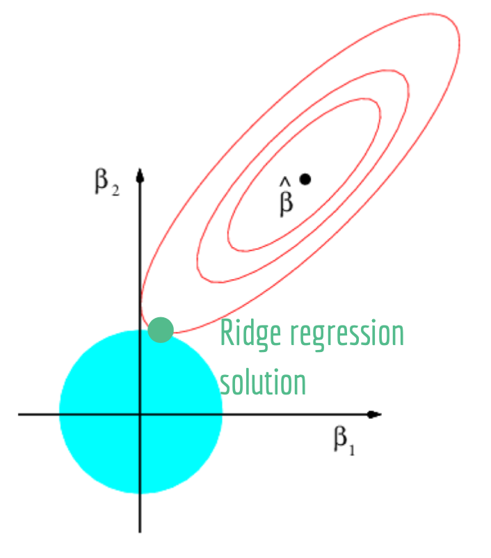

## Introduction
   
Lasso, an abbreviation for “least absolute shrinkage and selection operator”, was developed independently in the field of geophysics in 1986 (“Lasso (statistics)”). The technique was rediscovered, named, and popularized by statistician Robert Tibshirani in 1996, in his paper “Regression Shrinkage and Selection via the Lasso”. The topic of lasso stood out to our group as an option for the final project because we have all had experiences applying the technique in our Machine Learning courses. Lasso is also connected to the section of our Mathematical Statistics course devoted to linear models. In particular, lasso was developed as a method to overcome certain complaints that data analysts had with ordinary least squares (OLS) regression models, namely, prediction accuracy and interpretation. OLS estimates often have low bias but high variance, meaning that prediction accuracy can sometimes be improved by shrinking or setting to zero some regression coefficients. Further, OLS models typically contain a large number of predictors; we often would like to narrow this down to a smaller subset that exhibits the strongest effects [@JSTOR].

Lasso falls under the category of penalized or regularized regression methods. Penalized regression methods keep all the predictor variables in a model but constrain or regularize their regression coefficients by shrinking them towards zero. In certain cases, if the amount of shrinkage is large enough, these methods can also serve as variable selection techniques by shrinking some coefficients to zero [@SaSInstitude]. This is the case with lasso, which provides both variable selection and regularization to enhance the prediction accuracy and the interpretability of the resulting statistical model. Lasso was originally developed for use on linear regression models, but is easily extended to other statistical models including generalized linear models, generalized estimating equations, and proportional hazards models (“Lasso (statistics)”). In terms of real world applications, lasso is commonly used to handle genetic data because the number of potential predictors is often large relative to the number of observations and there is often little prior knowledge to inform variable selection [@BJSSociety]. 

The sources we explored to learn about lasso in greater depth were “LASSO regression”, a brief overview of the technique written by J. Ranstam and J.A. Cook, Tibshirani’s paper mentioned above, and the chapter on lasso in An Introduction to Statistical Learning (ISLR; a statistics textbook commonly used in Machine Learning courses) by Gareth James et al. 

Ranstam and Cook provide a nice introductory look into lasso, explaining the motivation behind the method (standard regression models often overfit the data and overestimate the model’s predictive power), a general description of how lasso works including the role of cross-validation in selecting the tuning parameter $\lambda$, and some of the limitations of the method. 

Tibshirani’s paper proposes a new method for estimation in linear models (“the lasso”), explains the mathematical derivation of this method, and presents the results of various simulation studies, comparing the novel method to more established methods of variable selection and regularization, subset selection and ridge regression. Tibshirani concludes by examining the relative merits of the three methods in different scenarios, stating that lasso performs best in situations where the predictors represent a small to medium number of moderate-sized effects.

ISLR provided us with the most comprehensive (and understandable) look into lasso. ISLR explains the mathematics involved in lasso and provides an in-depth comparison to ridge regression at the mathematical, geometrical, and functional levels. The textbook concludes that neither method will universally dominate the other, but that lasso tends to perform better in situations where only a relatively small number of predictors have substantial coefficients, while ridge regression tends to perform better when the response variable is a function of many predictors, all with coefficients of relatively equal size. Finally, ISLR proved extremely useful to us because it included various graphs and visualizations that illustrate how and why lasso works the way it does.

In the background section of this report, we will describe the mathematical underpinnings of the lasso, ridge regression and OLS regression. This will include notation, an explanation of the “penalty term” used in lasso and ridge regression, and alternate interpretations of how lasso and ridge regression work. In the main results section, we derive the estimators for OLS and ridge regression and create a simulation to understand the lasso estimators. We will introduce the set-up for a simulation experiment using R that demonstrates the merits and drawbacks of using lasso in comparison to OLS regression. Then, we will compare relevant aspects of the models: regression coefficients, error metrics, and the bias and variance of model predictions. The discussion section summarizes the main takeaways of our research.

## Background

### Overfitting and the Bias-Variance Tradeoff
When models are created, a specific set of data is used to 'train' them. From this training data, all the coefficients and other parameters of the model are determined. Even though a model is trained on a very specific set of data, it is often applied to other data sets. A model that is 'overfit' to the training data will make accurate predictions for the training data, but will make significantly less accurate predictions when applied to different data. Overfitting occurs when the model is too sensitive to the training data and ends up picking up on, and modeling, random quirks of this subset of data. We wish to avoid overfitting our models to ensure that they are able to make accurate predictions on unknown data [@Springer]. 

Two important properties of a model and its parameters are bias and variance. Bias is the difference between the average value that the model predicts and the true average; we want our model to be pinpointing the correct average, but this is often extremely challenging to do because models are simplifications of more complicated phenomena. Variance describes how much the estimates of a model would change if the model was fit using a different dataset. We do not want our model estimates to fluctuate widely when different data is used; this is an indication that the model is not capturing trends common to all the data. Overfit models tend to have low bias, but high variance -- they are able to very accurately capture the trends of the training data, but they do not generalize well to other data. Ideally, we would like to minimize both bias and variance, but it turns out that these two properties are interrelated. Decreasing bias tends to increase variance and decreasing variance tends to increase bias. When constructing a model, the goal is balance between bias and variance effectively to yield an accurate, yet more general model [@Springer].

### Variable Selection
Whenever we are trying to model data with many possible predictors, we want to determine which variables are important for predicting the outcome variable. We could include every predictor but often this yields a complicated and less meaningful model. Variable selection is the ability of some models to choose which variables are irrelevant to the model and which variables help predict the outcome variable. Models accomplish variable selection by setting a variable's coefficient equal to 0. Variable selection is an extremely useful ability of some models, especially when data context cannot inform variable selection [@Springer]. 

### Ordinary Least Squares Estimation
In ordinary least squares estimation (OLS), we attempt to find a linear model that best fits the data. Our model is a polynomial $\hat{y} = \beta_0 +\beta_1x_1 + \beta_2x_2 + \space ...  \space + \beta_nx_n$ with unknown coefficients $\beta_0, \space \beta_1, \space \beta_2, \space .., \space \beta_n$. In the method of least squares, we find the values of these coefficients that minimize the distance between the true $y$ values and the predicted $y$ values $\hat{y}$. We define this distance as a residual: $y_i- \hat{y}$. To get an overall estimate of the prediction error of our model, we compute the residual for each observation, square the residuals and sum these values [@Springer]. We can write this as:  

$$
\sum_{i=1}^n (y_i - \hat{y}_i)^2 = \sum_{i=1}^n (y_i - [\beta_0 +\beta_1x_1 + \space ...  \space + \beta_nx_n])^2 \\
= \sum_{i=1}^n ( y_i +\beta_0 - \sum_{j=1}^p \beta_jx_{ij} )^2
$$
We can summarize the least squares method as: 
$$
\text{argmin}_{\beta_0,..., \beta_n}\sum_{i=1}^n ( y_i +\beta_0 - \sum_{j=1}^p \beta_jx_{ij} )^2
$$
Instead of using standard mathematical notation, we can write linear models and the least squares method in matrix notation. In matrix notation, a linear model is written as: 

$$\mathbf{y} = \mathbf{X}\boldsymbol\beta  + \boldsymbol\epsilon, \text{ where } E[\boldsymbol\epsilon] = \mathbf{0}$$.

$\mathbf{y}$ is the vector of outcomes, $\boldsymbol\beta$ is the vector of covariates, and $\mathbf{X}$ is the matrix of covariates: 
$$\mathbf{y} = \begin{pmatrix} y_1 \\ y_2 \\ \vdots \\ y_n \end{pmatrix}; \space\boldsymbol\beta = \begin{pmatrix} \beta_0 \\ \beta_1 \\ \vdots \\ \beta_p \end{pmatrix}; \space \mathbf{X} = \begin{pmatrix} 1 & x_{11} & \cdots & x_{p1} \\ 1 & x_{12} & \cdots & x_{p2} \\ \vdots & \vdots & \ddots & \vdots \\ 1 & x_{1n} & \cdots & x_{pn} \end{pmatrix}.$$ 
The least squares estimation method then becomes: 

$$\text{argmin}_{\boldsymbol\beta} (\mathbf{y} - \mathbf{X}\boldsymbol\beta)^\top(\mathbf{y} - \mathbf{X}\boldsymbol\beta)$$.

### Problems with Ordinary Least Squares Estimation 
OLS models are incredibly useful and form the basis of many other models, but they have problems that other models can address. OLS models tend to overfit the data, leading to highly variable predictions when they are applied to new data. They have high variance, especially when making predictions on the extreme, and thus do not generalize to new contexts. Additionally, they cannot perform variable selection, making the models challenging to interpret when there are a large number of predictors. Furthermore, OLS models struggle when predictors are correlated [@Springer]. Because of these problems, OLS models are not appropriate in many circumstances, even when a linear model is a good option. 

### Lasso
  Lasso is an adjustment to the linear regression framework. In a lasso model, the goal is the same as for OLS model: minimize the RSS. However, we add an additional penalty term, shown in red below, that limits the values of the coefficients [@Springer]. Specifically, lasso is defined as: 
  
  $$\text{argmin}_{\beta_j}\sum_{i=1}^n ( y_i +\beta_0 - \sum_{j=1}^p \beta_jx_{ij} )^2 + \color{red}{\lambda \sum_{j=1}^p |\beta_j|}$$
When minimizing this quantity as a whole, we are minimizing each component -- both the RSS and the penalty term. Minimizing the penalty term, for a given $\lambda$, has the effect of reducing the values of the coefficients towards zero [@Springer]. The constant $\lambda$ allows us to control how much the coefficients are shrunk towards zero and is thus considered a tuning parameter for lasso models. Large $\lambda$ values weight the penalty term heavily, so the coefficient values must be very small to minimize the overall function. Small $\lambda$ values reduce the importance of the penalty term allowing the coefficients to be larger. In the extreme, if $\lambda$ is infinitely large, the coefficients would all become zero; if $\lambda$ is zero, the coefficients would be the OLS solution [@Springer]. We discuss how to choose $\lambda$ in the next section.  

  There is an alternate formulation of lasso that reveals how it is a constrained optimization problem. In this formulation, we define lasso as: 
$$
\text{argmin}_{\beta_j}\sum_{i=1}^n ( y_i +\beta_0 - \sum_{j=1}^p \beta_jx_{ij} )^2  \text{; subject to }  \sum_{j=1}^p |\beta_j| \le s.
$$
In this formulation it is clear that the goal remains to minimize the RSS; however, the values of the coefficients are subjected to an additional constraint. Instead of using the tuning parameter $\lambda$, the tuning parameter $s$ is used. For large values of $s$, the coefficients are unconstrained and can have large values. Small values of $s$ impose a tight constraint on the coefficients, forcing them to be small [@Springer]. 
  With this formulation of lasso, we can visualize the relationship between the RSS and the constraint in a two predictors setting. With two predictors, the constraint region is defined as $|\beta_1| + |\beta_2| \le s$; this is a diamond with height $s$. In the graph below, the blue diamond is the constraint region, the red ellipses represent contour lines of the RSS, and $\hat{\beta}$ is the OLS solution (the absolute minimum of the RSS). In a lasso model, the goal is to find the smallest RSS that is within the constraint region; in this graph, that is the point where the ellipses intersect the diamond at its top corner [@Springer]. 
  


### Selecting the Tuning Parameter
The tuning parameter is often selected using cross validation. With cross validation, the data are randomly divided into equally sized groups called folds. In one iteration, k-1 folds are reserved for training the model and 1 fold is reserved for testing the model. The error in the predictions generated by the model is computed for the test fold. This process is repeated until all the folds are used for testing. Then, the average test error is computed across all the folds. For selecting $\lambda$, we compute cross validated error metrics for many different values of $\lambda$ and choose a value of $\lambda$ that leads to low error [@Springer]. 

### Comparison to Ridge Regression
  Ridge regression is another technique that modifies the OLS framework by constraining the values of the coefficients. Ridge regression is defined as: 
 $$\text{argmin}_{\beta_j}\sum_{i=1}^n ( y_i +\beta_0 - \sum_{j=1}^p \beta_jx_{ij} )^2 + \color{red}{\lambda \sum_{j=1}^p (\beta_j)^2}$$.
We can see that ridge regression is nearly identical to lasso; the only difference is in the penalty term (shown above in red). Instead of taking the absolute value of the coefficients, ridge regression squares the coefficients (James et al., 2013). 
  We can consider the constrained optimization formulation of ridge regression, as we did for lasso: 
$$
\text{argmin}_{\beta_j}\sum_{i=1}^n ( y_i +\beta_0 - \sum_{j=1}^p \beta_jx_{ij} )^2  \text{; subject to }  \sum_{j=1}^p (\beta_j)^2 \le s.
$$
With two predictors, the constraint region becomes a circle: $\beta_1^2 + \beta_2^2 \le s^2$ (James et al., 2013). We can construct a very similar graph to the one above: 


  By comparing these two graph, we can tell that the only difference between lasso and ridge regression are their constraint regions. In the next section, we discuss an important implication of this difference. 
  
### The Constraint Region and Variable Selection
Lasso's constraint region allows it to perform variable selection, while ridge regression's does not. In the two dimensional example, lasso's constraint region is a diamond. In a diamond, the points that line farthest from the center, the points that are most likely to intersect with the RSS contours, are the corners. These corners lie on the axes; if an RSS contour intersects the constraint region at a corner, one coefficient will be set to 0. If a coefficient is set to 0, it is selected out of the model. For ridge regression's circular constraint region, all of the points on the perimeter lie equidistant to the center -- no point is more likely to intersect an RSS contour than any other point. So, the contours lines do not intersect at an axis for ridge regression, making it impossible for this technique to perform variable selection [@Springer].  

### Benefits of Lasso and Ridge Regression
Both lasso and ridge regression are able to make more accurate predictions than OLS in many contexts. Lasso and ridge regression are often more accurate than OLS because they sacrifice a small increase in bias for a significant reduction in variance. Both ridge regression and lasso perform well in a variety of contexts, but the variable selection property of lasso is a significant advantage. Lasso models have fewer predictors, making them easier to interpret. Ridge regression, because it includes every variable in the model, outperforms lasso when all of the predictors are related to the outcome. On the other hand, lasso outperforms ridge regression when only a few of the predictors are related to the outcome [@Springer]. 

In the main results section, we will derived the variance of OLS and ridge regression estimators and perform a simulation to examine bias and variance in lasso estimators.

## Main Results

### Deriving OLS, Ridge Regression and Lasso Estimators

#### OLS

As described above, the OLS problem can be written as $\text{argmin}_{\boldsymbol\beta} (\mathbf{y} - \mathbf{X}\boldsymbol\beta)^\top(\mathbf{y} - \mathbf{X}\boldsymbol\beta)$. 

We can derive the OLS estimate for $\boldsymbol\beta$: 


\begin{aligned}

&\text{argmin}_{\boldsymbol\beta} (\mathbf{y} - \mathbf{X}\boldsymbol\beta)^\top(\mathbf{y} - \mathbf{X}\boldsymbol\beta) \\

&= \frac{\partial}{\partial \boldsymbol\beta} (\mathbf{y}^\top \mathbf{y} - \mathbf{y}^\top\mathbf{X}\boldsymbol\beta  - \boldsymbol\beta^T\mathbf{X}^Ty + \boldsymbol\beta^\top \mathbf{X}^\top \mathbf{X} \boldsymbol\beta) \\ 


&= \frac{\partial}{\partial \boldsymbol\beta} (\mathbf{y}^\top \mathbf{y} - 2\mathbf{y}^\top\mathbf{X}\boldsymbol\beta + \boldsymbol\beta^\top \mathbf{X}^\top \mathbf{X} \boldsymbol\beta) \\

&= -2\mathbf{X}^\top\mathbf{y} + 2 \mathbf{X}^\top \mathbf{X} \boldsymbol\beta \\

0 &\stackrel{set}{=} -2\mathbf{X}^\top\mathbf{y} + 2 \mathbf{X}^\top \mathbf{X} \boldsymbol\beta \\

2 \mathbf{X}^\top \mathbf{X} \boldsymbol\beta &= 2\mathbf{X}^\top\mathbf{y} \\ 

(\mathbf{X}^T\mathbf{X})^{-1}\mathbf{X}^\top \mathbf{X} \boldsymbol\beta &= (\mathbf{X}^T\mathbf{X})^{-1} \mathbf{X}^\top\mathbf{y} \\ 

 \hat{\boldsymbol\beta}& = (\mathbf{X}^T\mathbf{X})^{-1} \mathbf{X}^\top\mathbf{y}

\end{aligned}


#### Ridge Regression

In ridge regression, the formula we are trying to minimize is $\sum_{i=1}^n(y_i - \beta_0 - \sum_{j=1}^p\beta_j x_{ij})^2 + \lambda\sum_{j=1}^p \beta_j^2$. We can write this in matrix notation as: $(\mathbf{y} - \mathbf{X}\boldsymbol\beta)^\top(\mathbf{y} - \mathbf{X}\boldsymbol\beta) + \lambda \boldsymbol\beta^T\boldsymbol\beta$. We can minimize this in much the same way as in OLS: 

\begin{aligned}
&\text{argmin}_{\boldsymbol\beta} (\mathbf{y} - \mathbf{X}\boldsymbol\beta)^\top(\mathbf{y} - \mathbf{X}\boldsymbol\beta) + \lambda \boldsymbol\beta^T\boldsymbol\beta \\ 
&= \frac{\partial}{\partial \boldsymbol\beta} (\mathbf{y}^\top \mathbf{y} - 2\mathbf{y}^\top\mathbf{X}\boldsymbol\beta + \boldsymbol\beta^\top \mathbf{X}^\top \mathbf{X} \boldsymbol\beta + \lambda \boldsymbol\beta^T\boldsymbol\beta) \\
&= -2\mathbf{X}^\top\mathbf{y} + 2 \mathbf{X}^\top \mathbf{X} \boldsymbol\beta + 2\lambda\boldsymbol\beta \\
0 &\stackrel{set}{=} -2\mathbf{X}^\top\mathbf{y} + 2 \mathbf{X}^\top \mathbf{X} \boldsymbol\beta + 2\lambda\boldsymbol\beta\\
\mathbf{X}^\top \mathbf{X} \boldsymbol\beta + \lambda\boldsymbol\beta &= \mathbf{X}^\top\mathbf{y} \\ 
(\mathbf{X}^\top \mathbf{X} + \lambda\mathbf{I}) \boldsymbol\beta &= \mathbf{X}^\top\mathbf{y} \\ 
(\mathbf{X}^\top \mathbf{X} + \lambda\mathbf{I}) (\mathbf{X}^\top \mathbf{X} + \lambda\mathbf{I}) ^{-1}\boldsymbol\beta &= \mathbf{X}^\top\mathbf{y}(\mathbf{X}^\top \mathbf{X} + \lambda\mathbf{I}) ^{-1}\\ 
\boldsymbol\beta &= \mathbf{X}^\top\mathbf{y}(\mathbf{X}^\top \mathbf{X} + \lambda\mathbf{I}) ^{-1}\\ 
\end{aligned}

#### Considering a Simple Case
  We can consider a simple case: $\mathbf{X}$ is a diagonal matrix with 1's on the diagonals and 0's on all the off diagonals, the number of predictors equals the number of cases, and we force the intercept to go through the origin. This case allows us simplify our OLS and ridge regression estimators. For OLS, the solution is $\boldsymbol\beta = \mathbf{y}$ and for ridge regression the solution becomes $\boldsymbol\beta = \frac{\mathbf{y}}{1+\lambda}$. 
  Applying this simple case to find the estimators is helpful particularly for Lasso. Unlike OLS and Ridge Regression, there is no closed form solution for $\boldsymbol\beta$ for Lasso. To derive any estimators for Lasso, we must consider this simple case. 
  
#### Lasso Estimators in a Simple Case

For lasso, we can not find a general closed form solution for $\boldsymbol\beta$, so we will derive the lasso estimates for $\boldsymbol\beta$ for the simple case described above. We will not use matrix notation in order to easily apply the assumptions of our simple case. 

Remember that we can write the general form of lasso as: 

\begin{aligned}

\text{argmin}_{\beta}\sum_{i=1}^n(y_i - \beta_0 - \sum_{j=1}^p\beta_j x_{ij})^2 + \lambda\sum_{j=1}^p |\beta_j|

\end{aligned}

If we apply our simplifying assumptions, we can write:

\begin{aligned}

\text{argmin}_{\beta}\sum_{j=1}^p(y_i - \beta_1)^2 + \lambda|\beta_1| 

\end{aligned}

With these assumptions, we can find a closed form solution for $\beta$: 

\begin{aligned}

&\text{argmin}_{\beta}(y_i - \beta_1)^2 + \lambda|\beta_1| \\ 

&= \frac{\partial}{\partial \beta} \left( (y_j - \beta_1)^2 + \lambda|\beta_1| \right) \\

&= \frac{\partial}{\partial \beta} \left( y_j^2 - 2y_j\beta_1 + \beta_1^2 + \lambda|\beta_1| \right) \\

&=  - 2y_j + 2\beta_1 + \lambda sign(\beta_1) \\

\end{aligned}

To solve for $\beta_1$, we must consider different regions: (1) when $\beta_1 < 0$, (2) when $\beta_1 > 0$ and (3) when $\beta_1 = 0$.  

(1) when $\beta_1 < 0$ or when $y_j < - \lambda/2$: 

\begin{aligned}

0 &\stackrel{set}{=} - 2y_j + 2\beta_1 - \lambda \\

\beta_1 &= y_j + \lambda/2 \\

\end{aligned}

(2) when $\beta_1 > 0$ or when $y_j > \lambda/2$: 

\begin{aligned}

0 &\stackrel{set}{=} - 2y_j + 2\beta_1 + \lambda \\

\beta_1 &= y_j - \lambda/2 \\

\end{aligned}

(3) when $\beta_1 = 0$:

\begin{aligned}

\text{when } \beta_1 = 0 \text{ or when } |y_i| \le \lambda/2 : \\
0 

\end{aligned}


#### Visualizing the Simple Case Estimators
The graph below shows the simple case coefficient estimates for OLS, ridge regression and lasso as a function of the data $y_j$. We can see from that graph, and from the equations derived above, that ridge regression scales the coefficient estimates by the same factor, $1/(1+\lambda)$, regardless of the value of $y_j$. Since it is impossible to divide a non-zero number by any value and get 0, ridge regression cannot set any coefficient to zero unless it is already 0. However, lasso performs shrinkage in a different way, allowing some coefficients to be 0. Lasso changes the values of the coefficients by adding or subtracting $\lambda/2$, depending on the corresponding $y_j$. If $y_j$ is inside the region $(-\lambda/2, \lambda/2)$, the coefficient is shrunk to 0. 

```{r, echo=FALSE, warning=FALSE}
library(ggplot2)
lambda <- 5
ols <- function(x) x
ridge <- function(x) x/(1+lambda)
lasso <-function(x) ifelse(x > lambda/2, x-lambda/2,
   ifelse(x < -lambda/2, x+lambda/2, 
   ifelse( -lambda/2 <= x & x <= lambda/2, 0, 0)))


ggplot() +
  xlim(-10, 10)+
  geom_function(fun = ols,
                aes(color = 'OLS'),
                linetype = "dashed") +
  geom_function (fun = ridge,
                 aes(color = 'Ridge'),
                 lwd = 1.2)+
  geom_function(fun = lasso,
                aes(color = 'Lasso'),
                lwd = 1.2) +
  theme_bw()+
  theme(panel.grid.minor.x = element_blank(),
        panel.grid.minor.y = element_blank())+
  scale_color_manual(name = 'Models',
                     breaks = c('OLS', 'Ridge', 'Lasso'),
                     values = c('OLS'='gray54', 'Ridge'='olivedrab3', 'Lasso'='tan2'))+
  labs(y = "Coefficient Estimates", x = "yj")
  
```


## Deriving Bias and Variance of OLS and Ridge Regression Estimators

### OLS 

#### Bias
We will assume that $\mathbf{y} = \mathbf{X}\boldsymbol\beta  + \boldsymbol\epsilon$ and that $E[\boldsymbol\epsilon] = \mathbf{0}$. We can show that the least squares estimator $\hat{\boldsymbol\beta} = (\mathbf{X}^T\mathbf{X})^{-1} \mathbf{X}^\top\mathbf{y}$ is an unbiased estimator of $\boldsymbol\beta$: 

\begin{aligned}

E[\hat{\boldsymbol\beta}_{OLS}] &= E[(\mathbf{X}^T\mathbf{X})^{-1} \mathbf{X}^\top\mathbf{y}]\\
&= (\mathbf{X}^T\mathbf{X})^{-1} \mathbf{X}^\top E[\mathbf{y}], \text{ since X is fixed} \\
&= (\mathbf{X}^T\mathbf{X})^{-1} \mathbf{X}^\top E[\mathbf{X}\boldsymbol\beta  + \boldsymbol\epsilon], \text{ by assumption}\\
&= (\mathbf{X}^T\mathbf{X})^{-1} \mathbf{X}^\top (\mathbf{X}\boldsymbol\beta  + E[\boldsymbol\epsilon])\\
&= (\mathbf{X}^T\mathbf{X})^{-1} \mathbf{X}^\top (\mathbf{X}\boldsymbol\beta  + 0), \text{ by assumption}\\
&=(\mathbf{X}^T\mathbf{X})^{-1} (\mathbf{X}^\top\mathbf{X})\boldsymbol\beta \\
&= \boldsymbol\beta

\end{aligned}

#### Variance
We will assume that $\mathbf{y} = \mathbf{X}\boldsymbol\beta  + \boldsymbol\epsilon$, $E[\boldsymbol\epsilon] = \mathbf{0}$ and that $Var[\boldsymbol\epsilon] = \sigma^2 \mathbf{I}$. We can show that the variance of the least squares estimator $\hat{\boldsymbol\beta} = (\mathbf{X}^T\mathbf{X})^{-1} \mathbf{X}^\top\mathbf{y}$ is $Var[\hat{\boldsymbol\beta}] = \sigma^2(\mathbf{X}^T\mathbf{X})^{-1}$: 

\begin{aligned}

Var[\hat{\boldsymbol\beta}_{OLS}] &= Var[(\mathbf{X}^T\mathbf{X})^{-1} \mathbf{X}^\top\mathbf{y}]\\

&= (\mathbf{X}^T\mathbf{X})^{-1} \mathbf{X}^\top Var[\mathbf{y}]((\mathbf{X}^T\mathbf{X})^{-1} \mathbf{X}^\top)^\top, \text{ since } Var(\mathbf{Ax}) = \mathbf{A}Var(\mathbf{x})\mathbf{A}^\top \\

&= (\mathbf{X}^T\mathbf{X})^{-1} \mathbf{X}^\top Var[\mathbf{y}] \mathbf{X}(\mathbf{X}^T\mathbf{X})^{-1}, \text{ since } (\mathbf{AB})^\top = \mathbf{B}^\top\mathbf{A}^\top \text{ and } (\mathbf{A}^{-1})^\top = (\mathbf{A}^\top)^{-1} \\

&= (\mathbf{X}^T\mathbf{X})^{-1} \mathbf{X}^\top Var[\mathbf{X}\boldsymbol\beta  + \boldsymbol\epsilon] \mathbf{X}(\mathbf{X}^T\mathbf{X})^{-1}, \text{ by assumption}\\

&= (\mathbf{X}^T\mathbf{X})^{-1} \mathbf{X}^\top Var[\boldsymbol\epsilon] \mathbf{X}(\mathbf{X}^T\mathbf{X})^{-1}, \text{ since } \mathbf{X} \text{ and } \boldsymbol{\beta} \text{ are fixed}\\

&= (\mathbf{X}^T\mathbf{X})^{-1} \mathbf{X}^\top (\sigma^2\mathbf{I}) \mathbf{X}(\mathbf{X}^T\mathbf{X})^{-1}, \text{ by assumption} \\

&= \sigma^2(\mathbf{X}^T\mathbf{X})^{-1} (\mathbf{X}^\top \mathbf{X})(\mathbf{X}^T\mathbf{X})^{-1} \\

&= \sigma^2(\mathbf{X}^T\mathbf{X})^{-1} \\

\end{aligned}

### Ridge Regression
#### Bias
We will assume that $\mathbf{y} = \mathbf{X}\boldsymbol\beta  + \boldsymbol\epsilon$ and that $E[\boldsymbol\epsilon] = \mathbf{0}$. We can show that the ridge regression estimator $\boldsymbol\beta = (\mathbf{X}^\top \mathbf{X} + \lambda\mathbf{I}) ^{-1}\mathbf{X}^\top\mathbf{y}$ is a biased estimator of $\boldsymbol\beta$ (Taboga): 

\begin{aligned}

E[\hat{\boldsymbol\beta}_{ridge}] &= E[(\mathbf{X}^\top \mathbf{X} + \lambda\mathbf{I}) ^{-1}\mathbf{X}^\top\mathbf{y}]\\

&= E[(\mathbf{X}^\top \mathbf{X} + \lambda\mathbf{I}) ^{-1}\mathbf{X}^\top (\mathbf{X}\boldsymbol\beta + \boldsymbol\epsilon)], \text{ by assumption} \\

&= E[(\mathbf{X}^\top \mathbf{X} + \lambda\mathbf{I}) ^{-1}\mathbf{X}^\top (\mathbf{X}\boldsymbol\beta) + (\mathbf{X}^\top \mathbf{X} + \lambda\mathbf{I}) ^{-1}\mathbf{X}^\top (\boldsymbol\epsilon)] \\

&= E[(\mathbf{X}^\top \mathbf{X} + \lambda\mathbf{I}) ^{-1}\mathbf{X}^\top (\mathbf{X}\boldsymbol\beta)] + E[(\mathbf{X}^\top \mathbf{X} + \lambda\mathbf{I}) ^{-1}\mathbf{X}^\top (\boldsymbol\epsilon)] \\

&= (\mathbf{X}^\top \mathbf{X} + \lambda\mathbf{I}) ^{-1}\mathbf{X}^\top (\mathbf{X}\boldsymbol\beta) + (\mathbf{X}^\top \mathbf{X} + \lambda\mathbf{I}) ^{-1}\mathbf{X}^\top E[(\boldsymbol\epsilon)], \text{ since } \mathbf{X} \text{ and } \boldsymbol{\beta} \text{ are fixed} \\

&= (\mathbf{X}^\top \mathbf{X} + \lambda\mathbf{I}) ^{-1}\mathbf{X}^\top (\mathbf{X}\boldsymbol\beta) + (\mathbf{X}^\top \mathbf{X} + \lambda\mathbf{I}) ^{-1}\mathbf{X}^\top (0), \text{ by assumption } \\

&= (\mathbf{X}^\top \mathbf{X} + \lambda\mathbf{I}) ^{-1}\mathbf{X}^\top \mathbf{X}\boldsymbol\beta  \\

\end{aligned}

Since $E[\hat{\boldsymbol\beta}_{ridge}] = (\mathbf{X}^\top \mathbf{X} + \lambda\mathbf{I}) ^{-1}\mathbf{X}^\top \mathbf{X}\boldsymbol\beta$, the ridge regression estimator for $\boldsymbol{\beta}$ will always be biased, unless $\lambda = 0$. If $\lambda = 0$, the ridge regression estimator is equal to the OLS estimator, which we showed above is unbiased. 

### Variance
We will assume that $\mathbf{y} = \mathbf{X}\boldsymbol\beta  + \boldsymbol\epsilon$, $E[\boldsymbol\epsilon] = \mathbf{0}$ and that $Var[\boldsymbol\epsilon] = \sigma^2 \mathbf{I}$. We can show that the variance of the ridge regression estimator is $\sigma^2(\mathbf{X}^\top \mathbf{X} + \lambda\mathbf{I}) ^{-1}\mathbf{X}^\top \mathbf{X} (\mathbf{X}^\top \mathbf{X} + \lambda\mathbf{I})^{-1}$ [@StatLect]: 

\begin{aligned}
Var[\hat{\boldsymbol\beta}_{ridge}] &= Var((\mathbf{X}^\top \mathbf{X} + \lambda\mathbf{I}) ^{-1}\mathbf{X}^\top\mathbf{y})\\

&= (\mathbf{X}^\top \mathbf{X} + \lambda\mathbf{I}) ^{-1}\mathbf{X}^\top Var(\mathbf{y}) ((\mathbf{X}^\top \mathbf{X} + \lambda\mathbf{I}) ^{-1}\mathbf{X}^\top)^\top, \text{ since } Var(\mathbf{Ax}) = \mathbf{A}Var(\mathbf{x})\mathbf{A}^\top \\

&= (\mathbf{X}^\top \mathbf{X} + \lambda\mathbf{I}) ^{-1}\mathbf{X}^\top Var(\mathbf{X}\boldsymbol\beta + \boldsymbol\epsilon) ((\mathbf{X}^\top \mathbf{X} + \lambda\mathbf{I}) ^{-1}\mathbf{X}^\top)^\top, \text{ by assumption } \\

&= (\mathbf{X}^\top \mathbf{X} + \lambda\mathbf{I}) ^{-1}\mathbf{X}^\top (Var(\mathbf{X}\boldsymbol\beta) + Var(\boldsymbol\epsilon)) ((\mathbf{X}^\top \mathbf{X} + \lambda\mathbf{I}) ^{-1}\mathbf{X}^\top)^\top \\

&= (\mathbf{X}^\top \mathbf{X} + \lambda\mathbf{I}) ^{-1}\mathbf{X}^\top Var(\boldsymbol\epsilon) ((\mathbf{X}^\top \mathbf{X} + \lambda\mathbf{I}) ^{-1}\mathbf{X}^\top)^\top, \text{ since } \mathbf{X} \text{ and } \boldsymbol{\beta} \text{ are fixed} \\

&= (\mathbf{X}^\top \mathbf{X} + \lambda\mathbf{I}) ^{-1}\mathbf{X}^\top (\sigma^2\mathbf{I}) ((\mathbf{X}^\top \mathbf{X} + \lambda\mathbf{I}) ^{-1}\mathbf{X}^\top)^\top, \text{ by assumption }  \\

&= \sigma^2(\mathbf{X}^\top \mathbf{X} + \lambda\mathbf{I}) ^{-1}\mathbf{X}^\top) ((\mathbf{X}^\top \mathbf{X} + \lambda\mathbf{I}) ^{-1}\mathbf{X}^\top)^\top \\

&= \sigma^2(\mathbf{X}^\top \mathbf{X} + \lambda\mathbf{I}) ^{-1}\mathbf{X}^\top \mathbf{X} ((\mathbf{X}^\top \mathbf{X} + \lambda\mathbf{I}) ^{-1})^\top \\

& = \sigma^2(\mathbf{X}^\top \mathbf{X} + \lambda\mathbf{I}) ^{-1}\mathbf{X}^\top \mathbf{X} (\mathbf{X}^\top \mathbf{X} + \lambda\mathbf{I})^{-1} \\

\end{aligned}

We can show that the variance of the ridge regression estimator is equal to the variance of the OLS estimator when $\lambda = 0$: 

\begin{aligned}

Var[\hat{\boldsymbol\beta}_{ridge}] \text{ when } \lambda = 0: \\
&= \sigma^2(\mathbf{X}^\top \mathbf{X} + 0\mathbf{I}) ^{-1}\mathbf{X}^\top \mathbf{X} (\mathbf{X}^\top \mathbf{X} + 0\mathbf{I})^{-1} \\
&= \sigma^2(\mathbf{X}^\top \mathbf{X}) ^{-1}\mathbf{X}^\top \mathbf{X} (\mathbf{X}^\top \mathbf{X})^{-1} \\
&= \sigma^2(\mathbf{X}^\top \mathbf{X}) ^{-1} = Var[\hat{\boldsymbol\beta}_{OLS}]

\end{aligned}

Importantly, the variance of the ridge regression estimator is always smaller than the variance of the OLS estimator when $\lambda>0$. To see that this is true, we can consider the case when $\mathbf{X}$ is a 1 by 1 matrix with value 1 ([1]) and $\lambda = 1$:

\begin{aligned}

Var[\hat{\boldsymbol\beta}_{ridge}] &= \sigma^2(\mathbf{X}^\top \mathbf{X} + \lambda\mathbf{I}) ^{-1}\mathbf{X}^\top \mathbf{X} (\mathbf{X}^\top \mathbf{X} + \lambda\mathbf{I})^{-1} \\

&= \sigma^2(1 *1 + 1) ^{-1}1*1 (1*1 + 1)^{-1} \\

&= \sigma^2(2) ^{-1}(2)^{-1} \\

&= \frac{\sigma^2}{4} 

\end{aligned}

\begin{aligned}

Var[\hat{\boldsymbol\beta}_{OLS}] &= \sigma^2(\mathbf{X}^T\mathbf{X})^{-1} \\

&= \sigma^2(1 *1) ^{-1} \\

&= \frac{\sigma^2}{1} = \sigma^2

\end{aligned}

From this simple case, we can see that $Var[\hat{\boldsymbol\beta}_{ridge}]$ is smaller than $Var[\hat{\boldsymbol\beta}_{OLS}]$. This holds true for all cases when $\lambda>0$, but the proof of that is beyond the scope of this project [@StatLect]. 
 
### Lasso
Lasso, unlike OLS and ridge regression, does not have closed form solutions for the bias and variance of its estimator. To examine the bias and variance of lasso estimators, we constructed a simulation and we discuss the results of the simulation in the next section. 

## Simulation

For the simulation, we generated a dataset of 9 variables, 3 of which are highly correlated with one another. The 9th variable is the $y$ variable that we will be trying to predict. This outcome variable is a linear combination of 2 correlated variables, 3 independent variables, and some noninformative variables. We also added some measurement error to $y$.  The true form of $y$ is as follows: $y = 0v_1 +2v_2 +2v_3+ 5v_4 +5v_5 +5v_6 + 3v_7 + 0v_8+\text{rnorm}(0,6)$. The rnorm adds measurement noise to model. First, we fit an OLS model to the data, and then we fit a lasso regression model. We compare the coefficient estimates for both the OLS model and the lasso model to the true coefficient estimates. We also examine the bias and variance of the estimates from both models. 

```{r setup, include=FALSE}
library(MASS)
library(tidyverse)
library(GGally)
library(tidymodels)
library(readr)
library(broom)
library(ggplot2)
library(stringr)
library(janitor)
```

```{r, echo=FALSE, warning=FALSE}
# data set
# create the variance covariance matrix
set.seed(1)
sigma<-rbind(c(1,0.8,0.7), c(0.8,1, 0.95), c(0.7,0.95,1))

# scale up the covariance matrix
sigma <- 5*sigma

# create the mean vector
mu<-c(4,5,5) 

# generate the multivariate normal distribution
df <- as.data.frame(mvrnorm(n=10000, mu=mu, Sigma=sigma))

# generate uncorrelated values 
V4 <- rnorm(1000, mean=10, sd=2)
V5 <- rnorm(1000, mean=3, sd=7)
V6 <- rnorm(1000, mean = 8, sd = 10)
V7 <- rnorm(1000, mean = 3, sd = 3)
V8 <- rnorm(1000, mean = 5, sd = 2)
df <- cbind(df, V4, V5, V6, V7, V8)
```

```{r, echo=FALSE, warning=FALSE}
V1Coef <- 0 #REMEMBER, THESE (V1, V2, V3) ARE HIGHLY CORRELATED 
V2Coef <- 2 #REMEMBER, THESE (V1, V2, V3) ARE HIGHLY CORRELATED 
V3Coef <- 2 #REMEMBER, THESE (V1, V2, V3) ARE HIGHLY CORRELATED 
V4Coef <- 5
V5Coef <- 5
V6Coef <- 5
V7Coef <- 3
V8Coef <- 0

# make the Y variable and add some random noise
df1 <- df %>% 
  mutate(y = V1Coef*V1 + V2Coef*V2 + V3Coef*V3 + V4Coef*V4+V5Coef*V5+V6Coef*V6+ V7Coef*V7 + V8Coef*V8 + rnorm(10000,0,6))
```

#### Coefficient Estimates
```{r, echo=FALSE, warning=FALSE}
tidymodels_prefer() # Resolves conflicts, prefers tidymodel functions
set.seed(23)

# set the engine (how R actually makes the model) and the mode (either regression or classification)
lm_spec <-
    linear_reg() %>% 
    set_engine(engine = 'lm') %>% 
    set_mode('regression')

# Here we create a recipe (the model + all the preprocessing steps) that is very important for lasso. We use it for the OLS model to make sure we are modifying the data in the same way for all models. 

full_rec <- recipe(y ~ ., data = df1) %>% # we want to model y based on all the predictors (. means include every predictor)
    step_nzv(all_predictors())  %>% # important standardization step for LASSO
    step_dummy(all_nominal_predictors())  # creates indicator variables for categorical variables


full_lm_wf <- workflow() %>% # in the workflow we combine the recipe with the model specification
    add_recipe(full_rec) %>%
    add_model(lm_spec)

full_model <- fit(full_lm_wf, data = df1) # fit the model to the data
full_model %>% tidy()
```

The table above provides the coefficient estimates and their standard errors for the linear model. For the correlated variables, ($v_1, v_2, v_3$), the standard errors are higher than for the noncorrelated variables because the linear model struggles to deal with multicollinearity. The linear model can distinguish between variables with true non-zero coefficients and noninformative variables, but it did not set the coefficients of the noninformative variables exactly to 0. 

```{r, echo=FALSE, warning=FALSE}
# Lasso Regression
tidymodels_prefer()
set.seed(74)

# Create CV folds
data_cv10 <- vfold_cv(df1, v = 10)

# Lasso Model Spec with tune
lm_lasso_spec_tune <- 
  linear_reg() %>%
  set_args(mixture = 1, penalty = tune()) %>% ## mixture = 1 indicates Lasso
  set_engine(engine = 'glmnet') %>% # we use the glmnet engine to do lasso
  set_mode('regression') 

# Workflow (Recipe + Model)
lasso_wf_tune <- workflow() %>% 
  add_recipe(full_rec) %>% # using the same recipe created above
  add_model(lm_lasso_spec_tune) 

# Tune Model (trying a variety of values of Lambda penalty)
penalty_grid <- grid_regular(
  penalty(range = c(-1, 5)), #log10 transformed 
  levels = 100)

tune_output <- tune_grid( # new function for tuning hyperparameters
  lasso_wf_tune, # workflow
  resamples = data_cv10, # cv folds
  metrics = metric_set(rmse, mae),
  grid = penalty_grid # penalty grid defined above
)
metrics_output <- collect_metrics(tune_output) %>%
  filter(.metric == 'mae') 
```

```{r, echo=FALSE, warning=FALSE}
best_penalty <- select_best(tune_output, metric = 'mae') # choose penalty value based on lowest mae
best_penalty
best_se_penalty <- select_by_one_std_err(tune_output, metric = 'mae', desc(penalty)) # choose penalty value based on the largest penalty within 1 SE of the lowest CV MAE
#best_se_penalty
```

```{r, echo=FALSE, warning=FALSE}
final_wf_se <- finalize_workflow(lasso_wf_tune, best_se_penalty) # incorporates penalty value to workflow
final_fit_se <- fit(final_wf_se, data = df1)
tidy(final_fit_se)
```
The table above displays the coefficient estimates generated by the lasso model. Unlike the OLS model, lasso was able to set the coefficient's of the noninformative variables exactly to 0. 

#### Model Accuracy
```{r, echo=FALSE, warning=FALSE}
# Simple Linear Regression Accuracy
set.seed(74)

# Create CV folds
data_cv10 <- vfold_cv(df1, v = 10)

fit_cv <- fit_resamples(full_lm_wf,
              resamples = data_cv10,
              metrics = metric_set(rmse, mae) # chosen metrics 
)
  
fit_cv %>% collect_metrics() 
```

```{r, echo=FALSE, warning=FALSE}
# Lasso Accuracy

set.seed(74)

# Create CV folds
data_cv10 <- vfold_cv(df1, v = 10)

fit_cv <- fit_resamples(final_fit_se,
              resamples = data_cv10,
              metrics = metric_set(rmse, mae)
)
  
fit_cv %>% collect_metrics() 
```
The two tables above show the overall accuracy of the two models according to two different error metrics MAE and RMSE. Comparing the models' accuracy reveals that the lasso model is slightly less accurate than the OLS model; however, this difference is very small. Although the lasso model is less accurate, it's ability to set coefficients to 0 and thus perform variable selection is a significant advantage over the OLS model. In the next section, we will examine how the lasso coefficient estimates change as we alter the value of the tuning parameter $\lambda$. 

#### Changing the Tuning Parameter

```{r, echo=FALSE, warning=FALSE}
# Changing Lambda 
glmnet_output <- final_fit_se %>% extract_fit_parsnip() %>% pluck('fit') # extracting the original glmnet output

lambdas <- glmnet_output$lambda
coefs_lambdas <- 
  coefficients(glmnet_output, s = lambdas )  %>% 
  as.matrix() %>%  
  t() %>% 
  as.data.frame() %>% 
  mutate(lambda = lambdas ) %>% 
  select(lambda, everything(), -`(Intercept)`) %>% 
  pivot_longer(cols = -lambda, 
               names_to = "term", 
               values_to = "coef") %>%
  mutate(var = map_chr(stringr::str_split(term,"_"),~.[1]))

coefs_lambdas %>%
  ggplot(aes(x = lambda, y = coef, group = term, color = var)) +
  geom_line() +
  geom_vline(xintercept = best_se_penalty %>% pull(penalty), linetype = 'dashed') + 
  theme_classic() + 
  theme(legend.position = "bottom", legend.text=element_text(size=8))
```
This graph depicts what happens to the coefficient estimates as $\lambda$ increases. As $\lambda$ reaches 50, all of the coefficients are set to 0. However, the coefficients are not set to 0 at the same time. Both the coefficients of $v_1$ and $v_8$, the noninformative variables, were set to 0 with a very small $\lambda$. The most important variable (because of its large variance), $v_6$, is set to 0 only for very large values of $\lambda$. 

#### The Bias and Variance of the Coefficient Estimates
To get estimates for the bias and variance of the coefficient estimate for both models, we sampled 100 different datasets of coefficient values from the larger dataset generated in the beginning. 

```{r, echo=FALSE, warning=FALSE}
samples <- sample_n(df1,100)
lm <- lm(y~., data = samples)

matrix_coef <- summary(lm)$coefficients  # Extract coefficients in matrix
matrix_coef

my_estimates <- matrix_coef[ , 1]  
base <- as.data.frame(my_estimates)
base <- t(base)
base
```


```{r, echo=FALSE, warning=FALSE}
for(i in 1:200){
  samples <- sample_n(df1,100)
  lm <- lm(y~., data = samples)
  matrix_coef <- summary(lm)$coefficients  # Extract coefficients in matrix
  my_estimates <- matrix_coef[ , 1]  
  temp <- as.data.frame(my_estimates)
  temp <- t(temp)
  base <- rbind(base, temp)
}

lm_coef <- as.data.frame(base)
#head(lm_coef)
```


```{r, echo=FALSE, warning=FALSE}
temp <- tidy(final_fit_se) %>% 
  select(term, estimate) %>% 
  as.data.frame()
base_lasso <- t(temp)
base_lasso <- as.data.frame(base_lasso)
base_lasso <- base_lasso %>% 
  row_to_names(row_number = 1) %>% 
  mutate(across(everything(),as.numeric))
```


```{r, echo=FALSE, warning=FALSE}
for(i in 1:200){
  data <- sample_n(df1, 1000)
  final_fit_se <- fit(final_wf_se, data = data)
  
  temp <- tidy(final_fit_se) %>% 
    pull(estimate)  
  names(temp) <- tidy(final_fit_se) %>% pull(term)

  base_lasso <- bind_rows(base_lasso, temp)
}
lasso_coeff <- base_lasso
```


```{r, echo=FALSE, warning=FALSE}
colnames(lm_coef) <- paste(colnames(lm_coef),"lm",sep="_")
colnames(lasso_coeff) <- paste(colnames(lasso_coeff),"lasso",sep="_")

combined <- cbind(lm_coef, lasso_coeff)
```

```{r, echo=FALSE, warning=FALSE}
library(reshape)
combined %>% 
  select(V4_lasso, V4_lm) %>% # change coefs here
  melt() %>% ggplot(aes(x=value, fill = variable))+
  geom_density(alpha = 0.5) + 
  geom_vline(xintercept = V4Coef, linetype="dotted",  # change coefs here
                color = "blue", size=1.5) +
  theme_classic()
```
This graph visualizes how frequently $v_4$ had a specific coefficient value for each model. By comparing the most commonly occuring coefficient value for lasso and for OLS to the true value, we can tell that the lasso coefficient is more biased than the OLS coefficient. However, the variance of the lasso coefficient is far smaller than the variance for OLS coefficient. 

```{r, echo=FALSE, warning=FALSE}
combined %>% 
  select(V1_lasso, V1_lm) %>% # change coefs here
  melt() %>% ggplot(aes(x=value, fill = variable))+
  geom_density(alpha = 0.5) + 
  geom_vline(xintercept = V1Coef, linetype="dotted",  # change coefs here
                color = "blue", size=1.5) +
  theme_classic()
```
This graph depicts the bias and variance for a noninformative variable for both models. In this graph, the reduction in variance in the lasso model is even more extreme than in the graph for the informative variable. While both models seem to be relatively unbiased, the lasso model's small variance will yield more accurate predictions overall.  


```{r, echo=FALSE, warning=FALSE}
temp <- summarize_all(lasso_coeff, mean)
temp <- temp[1,]
temp <- as.data.frame(t(temp))
temp <- temp %>% slice(-1)
temp2 <- summarize_all(lasso_coeff, var)
temp2 <- temp2[1,]
temp2 <- as.data.frame(t(temp2))
temp2 <- temp2 %>% slice(-1) %>% 
  mutate(Variance = `1`) %>% 
  select(Variance)
actual_values <- as.data.frame(c(V1Coef,V2Coef,V3Coef,V4Coef,V5Coef,V6Coef,V7Coef,V8Coef))

lasso_stats <- cbind(temp,actual_values,temp2) %>% 
  mutate(Bias = `1` - `c(V1Coef, V2Coef, V3Coef, V4Coef, V5Coef, V6Coef, V7Coef, V8Coef)`,
         `Actual Value`=`c(V1Coef, V2Coef, V3Coef, V4Coef, V5Coef, V6Coef, V7Coef, V8Coef)`) %>% 
  select(Bias, Variance,`Actual Value`)

temp <- summarize_all(lm_coef, mean)
temp <- temp[1,]
temp <- as.data.frame(t(temp))
temp <- temp %>% slice(-1)
temp2 <- summarize_all(lm_coef, var)
temp2 <- temp2[1,]
temp2 <- as.data.frame(t(temp2))
temp2 <- temp2 %>% slice(-1) %>% 
  mutate(Variance = `1`) %>% 
  select(Variance)
actual_values <- as.data.frame(c(V1Coef,V2Coef,V3Coef,V4Coef,V5Coef,V6Coef,V7Coef,V8Coef))

lm_stats <- cbind(temp,actual_values,temp2) %>% 
  mutate(Bias = `1` - `c(V1Coef, V2Coef, V3Coef, V4Coef, V5Coef, V6Coef, V7Coef, V8Coef)`,
         `Actual Value`=`c(V1Coef, V2Coef, V3Coef, V4Coef, V5Coef, V6Coef, V7Coef, V8Coef)`) %>% 
  select(Bias, Variance,`Actual Value`)

colnames(lm_stats) <- paste(colnames(lm_stats),"lm",sep="_")
colnames(lasso_stats) <- paste(colnames(lasso_stats),"lasso",sep="_")

BiasVarianceStats <- cbind(lm_stats,lasso_stats) %>% 
  select(-`Actual Value_lm`) %>% 
  rename(`Actual Value` = `Actual Value_lasso`)
```

```{r, echo=FALSE, warning=FALSE}
BiasVarianceStats
```
This table shows the average bias and variance for each coefficient for both the OLS and lasso model. Overall, the variances for the coefficients in the lasso model are much smaller than the variances in the OLS model, but the biases are larger for the lasso model coefficients. 

## Discusion

To conclude our report, we will briefly discuss the relevance, limitations, and applications of lasso regression. Lasso is relevant because of its ability to address the shortcomings of OLS regression models. Specifically, lasso is able to account for multicollinearity of predictor variables and correct for overfitting in situations with a large number of predictors. Furthermore, unlike some penalized regression methods (e.g., ridge regression) lasso has the ability to perform variable selection, by shrinking the regression coefficients of certain predictors to zero, thus improving model interpretability. 
	
In the main results section, we derived the estimators for OLS and ridge regression and the bias and variance of these estimators. Additionally, we included relevant outputs and visualizations from a simulation experiment in which we compared the performance of lasso and OLS in modeling a fictitious dataset. There were two main takeaways from our simulation experiment. First, lasso, unlike OLS, performs variable selection by shrinking the coefficients of uninformative predictors to zero. In the coefficient output tables, we saw that lasso set the coefficients of uninformative predictors (which we had given a true value of zero in the data creation stage) to zero, while OLS gave these variables very small nonzero coefficient values. Thus, lasso helps to simplify the model (and prevent overfitting) by eliminating predictors with negligible effects on the output. The second main takeaway was that lasso, in comparison to OLS, provides an advantage in terms of the bias-variance tradeoff. The density plots from our simulations show how lasso returns predictor coefficient estimates that are slightly more biased, but much less variable. 

In spite of the results of our simulation, it is important to recognize that lasso is not a cure-all for the issues of overfitting and multicollinearity and does not remove the need to validate a model on a test dataset. The primary limitation of lasso is that it trades off potential bias in estimating individual parameters for a better expected overall prediction. In other words, under the lasso approach, regression coefficients may not be reliably interpreted in terms of independent risk factors, as the model’s focus is on the best combined prediction, not the accuracy of the estimation and interpretation of the contribution of individual variables. Also, lasso may underperform in comparison to ridge regression in situations where the predictor variables account for a large number of small effects on the response variable. 

In the real world, lasso is commonly used to handle genetic data because the number of potential predictors is often large relative to the number of observations and there is often little prior knowledge to inform variable selection (Ranstam & Cook 1). Lasso also has applications in economics and finance, helping to predict events like corporate bankruptcy. Besides these specific fields of application, lasso is also implementable in any situation where multiple linear regression would apply. Multiple linear regression has wide-ranging applications, but to provide a specific example, it is often used in medical research. Researchers may want to test whether there is a relationship between various categorical variables (e.g., drug treatment group, patient sex), quantitative variables (e.g., patient age, cardiac output), and a quantitative outcome (e.g., blood pressure). Multiple linear regression allows researchers to test for this relationship, as well as quantify its direction and strength. Lasso regression may come into play in scenarios where multicollinearity exists (e.g., patient height and weight), there are a large number of predictors (and it is likely some are uninformative), and when it is important to have less-variable predictions for model coefficients. 


## References
