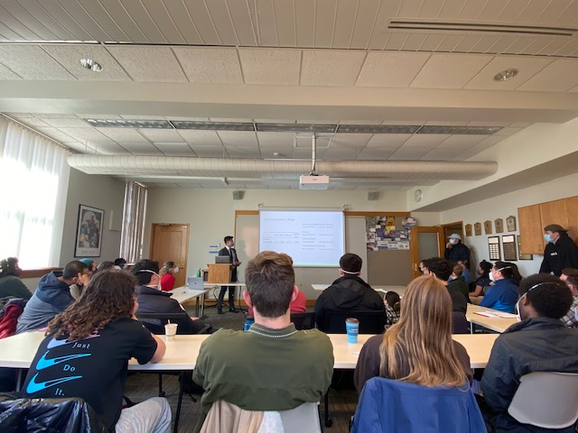

**Updated October 17, 2023**

I am currently a PhD Student in Statistics at Rice University! I obtained my undergraduate degree from Macalester College. Throughout Macalester I’ve had the opportunity to not only be a student under amazing professors, but to be a teaching assistant for Introduction to Statistical Modeling (STAT 155), Introduction to Computer Science (COMP 123), Principles of Economics (ECON 119), and Statistical Machine Learning (STAT 253), as well as a supplemental instructor for Econometrics (ECON 381). All of my experiences helped me find my passion for understanding concepts at a deep level. Being a teaching assistant and supplemental instructor taught me that one of the best ways to master a topic, and understand its ins and outs, is through the process of teaching. Perhaps I will find myself to be a professor one day!

In the summer of 2019, I conducted Causal Inference research with Professor Leslie Myint in collaboration with Professor Devavani Chatterjea in Biology. In this research project, we used the PLoS and Semnantic MEDLINE outputs in hopes of creating a diagram to better understand causal relationships between agents in Professor Chattergea’s work regarding vulvodynia. We did so by using journal abstracts to build a correlation matrix and run it through Tetrad, a causal search program. This was my first research project and I was astonished by how it pushed me to develop self autonomy and independent research skills while learning to collaborate on an interdisciplinary team.

In the summer of 2020, I interned as a business analyst at U.S. Bank’s wealth management division. Here I learned how to navigate a corporate environment and to effectively integrate my working style into an agile team.

Between my summers, I took a semester of leave to work at NutriKarma, a startup based in New York. My official position was “lead business developer.” However, while managing different projects, I discovered my passion for the technical and analytical side of operations.

During the summer of 2021, I interned on Ernst & Young’s Quantitative Economics and Statistics (QUEST) team. Here I enhanced my analytical skills through using R, STATA, and SAS. Working in a consulting environment also enhanced my interpersonal skills, specifically learning to effectively communicate quantitative analysis into information that can be used in business decisions.

In the 2021-2022 school year, I picked up an independent research project under the guidance of Professor Amy Damon. My project looked to explore the gendered impact of COVID-19, particularly in the context of Unemployment Insurance expiring. I managed to publish the thesis at The Developing Economist and also win the best undergraduate paper award at the 2022 Minnesota Economics Association conference.

Summer of 2022 I was a research analyst at Brattle Group! I supported leading academics in building advanced econometric models to determine liability and estimated damages in litigation that were tailored to the data and institutional contexts of the projects. 

After graduation in December 2022, I worked fulltime in D.C as a economic consultant at EY and then went backpacking around Asia! 

